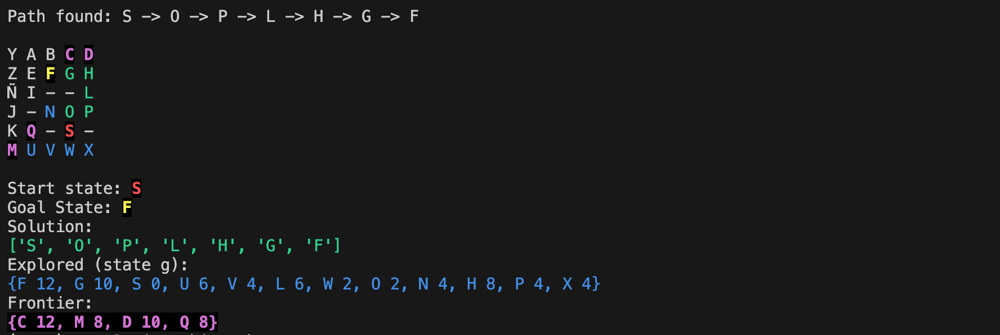

# Algoritmos resolución de problemas mediante búsquedas

## Ejercicios módulo Modelos de Intelixencia Artificial

### Instalación y Ejecución con uv

#### Instalación

1. Clona el repositorio:

```bash
git clone https://github.com/dfleta/problem-solving-searching.git
cd problem-solving-searching
```

Si quieres instalar las dependencias de desarrollo del proyecto, utiliza `uv`, sinom salta al epígrafe "ejecución".
2. Instala `uv`:

```bash
python -m pip install uv
```

3. Crea y activa un entorno virtual con `uv`:

```bash
uv venv
source .venv/bin/activate  # En Linux/MacOS
# O en Windows:
# .venv\Scripts\activate
```

4. Instala las dependencias del proyecto declaradas en `pyproject.toml`

```bash
uv sync
```

Recueda que puedes emplear la interfaz de `pip`:

```bash
pip install -r requirements.txt
```

5. Instala el linter `ruff`:

```bash
uv sync --group lint
```

#### Ejecución

El programa implementa el algoritmo A* y puede ejecutarse desde la línea de comandos con diferentes parámetros:

```bash
python a_star.py <estado_inicial> <estado_objetivo> [-v_c COSTO_VERTICAL] [-h_c COSTO_HORIZONTAL]
```

##### Parámetros

- `estado_inicial`: Estado desde donde comenzar la búsqueda
- `estado_objetivo`: Estado que se desea alcanzar
- `-v_c`: Costo para movimientos verticales (opcional, valor predeterminado: 1)
- `-h_c`: Costo para movimientos horizontales (opcional, valor predeterminado: 2)

##### Ejemplos de uso

1. Búsqueda básica de Z a N:

```bash
python a_star.py Z N
```

2. Búsqueda con costos personalizados

```bash
python a_star.py -v_c 2 -h_c 3 Z N
```

`python3 a_star -h`

```zsh
usage: a_star.py [-h] [-v_c V_C] [-h_c H_C] start_state goal_state

A* Search Algorithm

positional arguments:
  start_state  Initial state
  goal_state   Goal state

options:
  -h, --help   show this help message and exit
  -v_c V_C     Cost for vertical movements
  -h_c H_C     Cost for horizontal movements
```

#### Ejemplos

`python3 a_star.py -v_c 1 -h_c 2 Z N`

o

`python3 a_star.py Z N`


`python3 a_star.py -v_c 1 -h_c 2 S F`




### Algoritmo


El método `__update_g()` actualiza de manera recursiva todos los nodos de la frontera que son descendientes del nodo que se está actualizando. Veamos cómo funciona:

1. El método recibe dos parámetros:

   - `g_decrement`: la diferencia entre el valor g antiguo y el nuevo
   - `new`: el nodo que se acaba de actualizar

2. El proceso recursivo funciona así:

```py
   def __update_g(self, g_decrement, new):
       # Itera sobre todos los elementos en la frontera
       for element in self.get_elements():
           # Verifica si el elemento tiene un padre y si ese padre es el nodo que acabamos de actualizar
           if element.parent and element.parent.state == new.state:
               # Actualiza el valor g del elemento
               element.g -= g_decrement
               # Recalcula el valor f (f = g + h)
               element.f = element.g + element.h
               # Llamada recursiva para actualizar los hijos de este elemento
               self.__update_g(g_decrement, element)
```

La recursión ocurre porque:

1. Primero actualiza los hijos directos del nodo modificado

2. Para cada hijo actualizado, llama recursivamente a `__update_g()` para actualizar sus propios hijos

3. Este proceso continúa hasta que se hayan actualizado todos los descendientes en la frontera

### Ejercicio 1

Considérese el problema de encontrar un camino, en la situación representada en la figura, desde la posición $i$ hasta la posición $e$. El NPC (*non-player character*) puede moverse de forma horizontal y vertical, un solo cuadrado en cada movimiento (cada movimiento tiene coste uno). Las zonas sombreadas impiden el paso del NPC a través de ellas.


#### Consideraciones

- Para aquellos algoritmos en los que no es relevante el coste, el orden de los operadores (movimientos) es: **arriba, abajo, izquierda, derecha**.
- Si algún algoritmo no controla los ciclos, supondremos que existen mecanismos para eliminarlos.
- El **coste del movimiento**:
  - **Vertical**: 1.
  - **Horizontal**: 2.
- Para el algoritmo **A** se utilizará la **distancia Manhattan** como heurística:

$$ h(n) = {distancia \ horizontal} + {distancia \ vertical} $$

- En el ejemplo, la distancia Manhattan entre $i$ y $e$ es $4$.

#### Representación de la solución

- Resuelve el problema con cada uno de los algoritmos de búsqueda propuestos.
- Indica, para cada algoritmo, cuál se aplica para extraer los nodos de la frontera.
- Escribe:
  - La evolución del conjunto de nodos frontera.
  - El conjunto de nodos explorados durante el desarrollo del algoritmo.
  - La función coste y la heurística en los algoritmos que hagan uso de ellas.
- En la figura:
  - Nombra (enumera) los nodos según el orden en que son generados (incluidos en la frontera).
- Indica:
  - Cuándo la función test objetivo determina que el nodo chequeado es la solución.
  - La profundidad en la que se encuentra la solución.
- Razona y explica qué nodos y por qué conforman la solución.
- Representa:
  - El camino que conforma la solución (con una flecha en la figura).
  - El árbol de búsquedas.

### Ejercicio 2

#### Preguntas específicas

1. La heurística utilizada en el algoritmo **A**, ¿es admisible? ¿Por qué?
   - ¿Podemos decir que el algoritmo es **A***?

### Consideraciones sobre la búsqueda A*


Figura 3.15 Evaluación de los algoritmos de búsquedas. Russell y Norvig (2022)


Epígrafe 3.5.4 "_Satisficing search: Inadmissible heuristics and weighted A*_". Russell y Norvig (2022)


Figura 3.15 Evaluación de los algoritmos de búsquedas. Russell y Norvig (2022)

## Bibliografía

Russell, S. J., & Norvig, P. (2022). _Artificial intelligence: a modern approach_. Global edition. Pearson Education Limited.
